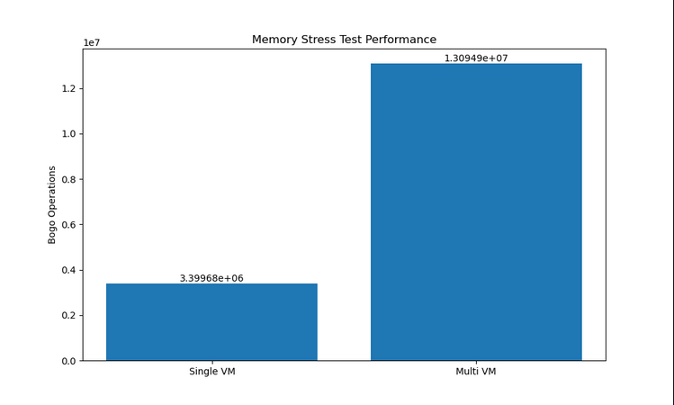
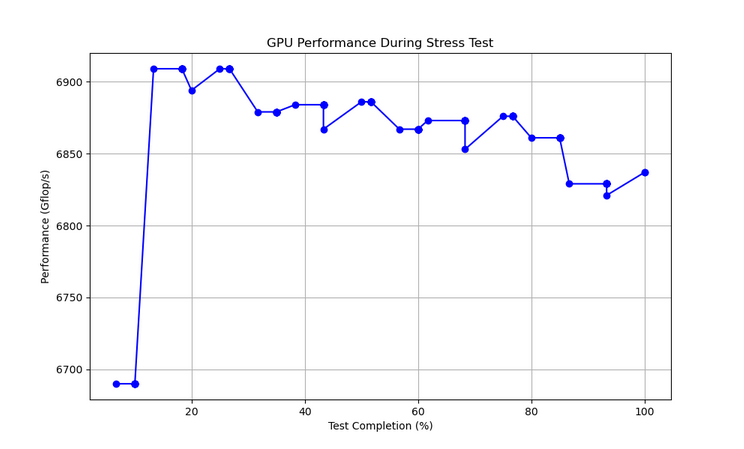

# Stress Tests

A comprehensive stress testing suite for evaluating system performance under various workloads, including CPU, memory, and GPU stress tests with automated report generation.

## Overview

This project provides automated stress testing capabilities for your system, with the following key features:

- CPU stress testing (single-core, multi-core, and all-core tests)
- Memory stress testing (single and multi-instance tests)
- Disk IO stress testing (write, read/write, and file allocation tests)
- GPU stress testing (with NVIDIA GPU support)
- Automatic detection of GPU compute capability
- Performance visualization with charts and graphs
- Comprehensive HTML report generation
- Test summary with visual status indicators

## Requirements

### System Requirements

- Linux operating system (tested on Ubuntu 22.04+)
- NVIDIA GPU with CUDA drivers (for GPU testing)
- Python 3.8 or higher
- Bash shell
- Sudo access for installation

### Dependencies

The project automatically installs the following dependencies:

- stress-ng (CPU and memory stress testing)
- build-essential (for building gpu-burn)
- NVIDIA CUDA toolkit (for GPU testing)
- Rust toolchain (for mdbook)
- Python packages: matplotlib, pyyaml

## Installation

1. Clone the repository:
```bash
git clone https://github.com/yourusername/stress-tests.git
cd stress-tests
```

2. Install Just (the command runner) and Pixi (optional):
```bash

# Install from source
cargo install just

# Install pixi for dependency management
curl -fsSL https://pixi.sh/install.sh | bash
```

3. Run the setup command to install all dependencies:
```bash
just setup
```

This will install all required tools and build the gpu-burn utility with the correct compute capability for your GPU using pixi for dependency management.

## Usage

### Running All Tests

To run a complete stress test suite with default settings (60 seconds per test):

```bash
just full_test
```

### Running Individual Tests

Run individual stress tests with a specified duration (in seconds):

```bash
# CPU tests
just cpu_single 60        # Single-core stress test
just cpu_multi 60         # Multi-core stress test (4 cores)
just cpu_all 60           # All cores stress test

# Memory tests
just mem_single 60        # Single memory stress test
just mem_multi 60         # Multi-instance memory test

# Disk IO tests
just disk_write_test 60   # Disk write operations test
just disk_io_test 60      # Disk read/write operations test
just disk_fallocate_test 60 # File allocation test

# GPU test
just gpu_stress 60        # GPU stress test
```

### Generating Reports

Generate just the plots:

```bash
just generate_plots
```

Generate just the report:

```bash
just generate_report
```

### Collecting System Information

To gather system information for the report:

```bash
just collect_sysinfo
```

## Output

After running the tests, you'll find:

1. Test results in the `report/results/` directory
2. Performance plots in `report/plots/`
3. Complete HTML report in `report/book/`

Open the report in your browser:

```bash
firefox report/book/index.html
```

### Sample Report

The generated report includes:

- Test Summary: Visual table showing pass/fail status for each test
- System Information: Detailed system specifications
- CPU Test Results: YAML-formatted results with performance metrics
- Memory Test Results: YAML-formatted results with performance metrics
- Disk IO Test Results: YAML-formatted results with performance metrics
- GPU Test Results: Log output from GPU stress test
- Performance Plots: Visual charts showing relative performance

## Test Results

The tests measure different performance metrics:

- **CPU Tests**: Bogo operations per second (higher is better)
- **Memory Tests**: Bogo operations per second (higher is better)
- **Disk IO Tests**: Bogo operations per second (higher is better)
- **GPU Tests**: Gflops per second (higher is better) and temperature monitoring

Example CPU performance chart:


Example Memory performance chart:



Example GPU performance chart:



## Customization

### Changing Test Duration

You can specify a custom duration for all tests:

```bash
just full_test 120    # Run tests for 120 seconds instead of default 60
```

Or modify individual tests:

```bash
just cpu_single 30     # Run single-core test for 30 seconds
```

### Modifying Memory Test Size

Edit the justfile to change memory allocation sizes:

```make
mem_single duration:
    mkdir -p report/results
    stress-ng --vm 1 --vm-bytes 10G --timeout {{duration}}s --progress --metrics-brief --verbose --yaml report/results/mem_single.yaml
```

Change `--vm-bytes 10G` to your desired memory size.

## Troubleshooting

### GPU Test Fails with PTX Error

If you encounter PTX JIT compilation errors with the GPU test:

```bash
# Rebuild gpu-burn with correct compute capability
rm -rf gpu-burn
just setup
```

The setup script automatically detects your GPU and builds gpu-burn with the appropriate compute capability.

### GPU Test Not Found

If you don't have an NVIDIA GPU or CUDA installed, you can skip the GPU test:

```bash
just collect_sysinfo
just cpu_single 60
just cpu_multi 60
just cpu_all 60
just mem_single 60
just mem_multi 60
just generate_plots
just generate_report
```

### Plots Not Displaying in Report

If plots aren't showing in the HTML report:

```bash
# Ensure plots are copied to the correct location
mkdir -p report/book/plots
cp report/plots/* report/book/plots/
```

## Architecture

The project is organized into several components:

- `justfile`: Contains all commands and workflows
- `scripts/`: Python scripts for data processing and report generation
  - `plot_data.py`: Generates performance plots including CPU, memory, disk IO, and GPU
  - `generate_report.py`: Creates markdown content for the report including disk IO tests
  - `detect_gpu.sh`: Detects GPU model and compute capability
  - `extract_gpu_data.py`: Extracts GPU performance data from logs
- `gpu-burn/`: NVIDIA GPU stress testing utility

## Contributing

We welcome contributions to the stress testing project! Here's how to get started:

### Development Setup

1. Fork the repository
2. Create a feature branch
3. Install the development dependencies:
```bash
just setup
```

### Making Changes

1. Make your changes to the relevant files
2. Test your changes thoroughly:
```bash
just full_test
```
3. Ensure the report generates correctly and all tests pass

### Submitting Changes

1. Commit your changes with a clear message
2. Push to your fork
3. Create a pull request with a detailed description of your changes

### Code Style

- Follow Python PEP 8 style guidelines
- Keep shell scripts simple and well-documented
- Add comments to complex logic

## License

This project is licensed under the MIT License. See the [LICENSE](LICENSE) file for details.

## Support

If you encounter any issues or have questions:

1. Check the [troubleshooting section](#troubleshooting)
2. Search existing [issues](https://github.com/yourusername/stress-tests/issues)
3. Create a new issue with details about your system and the error

## Acknowledgments

- [stress-ng](https://github.com/ColinIanKing/stress-ng) for CPU and memory stress testing
- [gpu-burn](https://github.com/wilicc/gpu-burn) for GPU stress testing
- [mdBook](https://github.com/rust-lang/mdBook) for documentation generation
- [matplotlib](https://matplotlib.org/) for plotting capabilities
- [pixi](https://pixi.sh/) for reproducible dependency management
```
